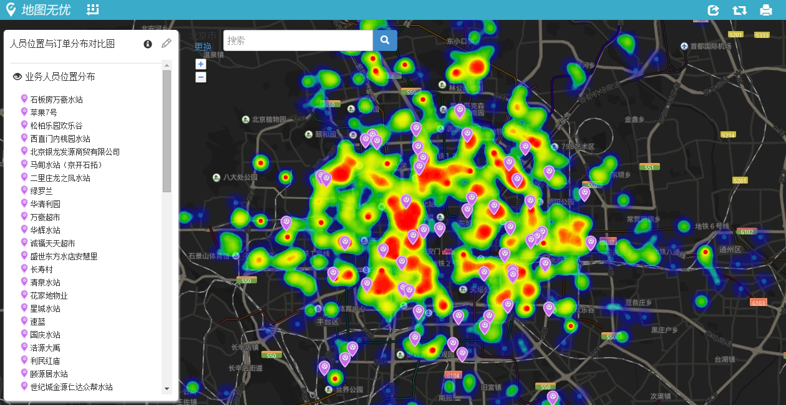

# 5分钟搞定基于位置的订单与人员匹配分析

如果你是O2O服务的运营决策者，一定希望服务人员能快速达到客户所在位置，一天之内能上门服务的次数足够多。这时候，回头分析一下历史客户订单的地理位置与服务人员的住址是否匹配，然后考虑根据订单位置信息调整下服务人员的地理空间布局，将非常有助于提升整体的效率。

先来看一张示意地图，地图有两个图层，热力图图层是上周客户订单分布，另一幅图层是服务人员的住址布局。在同一幅地图上，对比二者的匹配程度，是否在运营策略上会有些启发呢？

完成这样一幅地图，不用安装软件，不用编程，不用求人，通过地图无忧，只要5分钟。准备好两个Excel数据即可，一个是上周客户订单分布，一个是服务人员的分布，这些数据都无需姓名电话更个人信息，**有地址或经纬度坐标就好。**

第一步：新建热力图图层，上传客户订单数据，按提示配置即可。

第二步，新建点标注图层，上传服务人员位置数据，在地图上呈现即可。

第三步，其实两步已经够了，此外可以调个地图风格，把地图发布出来，共享给同事或领导等。

是不是很容易？快来试试吧。提高效率，刻不容缓，竞争胜负就看这个啦，哈哈。

 