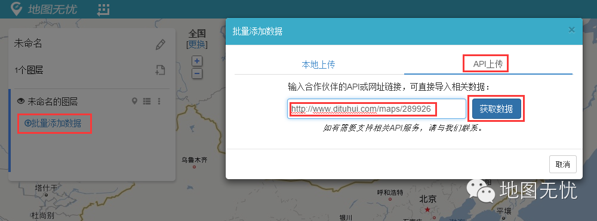

# 从地图汇导入数据

地图无忧除通过上传文件或手动方式添加数据到地图外，地图无忧还支持从第三方系统导入数据，地图汇就是其中之一。本文介绍如何把地图汇的地图数据导入到地图无忧的平台中，建议在电脑上按照本文进行操作。

1：登录地图无忧网站，「**进入工作台**」后，点击「**新建地图**」 ，进入地图编辑页面。

2：在左侧数据操作列表中，点击「**批量添加数据**」 ；在弹出的对话框中，点击「**API导入**」 ；然后在输入框中输入地图汇上你的**地图网址链接**，点击「**获取数据**」 按钮。

3：最后，根据对话框提示，选择用经纬度定位，然后选择相应的经纬度列，确认即可。

如果一切正常的话，就大功告成了。在地图无忧利用更专业的功能特性来管理你的业务地图吧！如果遇到什么问题了，欢迎随时找小图反馈。