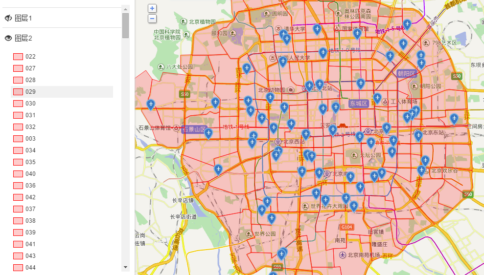

# 点面关系判断与点面绑定

很多时候，我们需要判断一些点标注属于哪一些商圈或服务区，比如：合作商家属于哪一个销售经理的服务片区；出租的房屋属于哪一个特定的商圈；订单地址被分配到哪一个配送区域等等。利用地图无忧，可以轻松搞定这个问题。

首选你得有一个区域图层，图层上绘制好你的商圈或销售片区或配送范围或招生范围等等。地图无忧为你提供了方便快捷的可视化绘制片区的方法，点击查看如何在地图无忧上新建区域图层>>  此外，如果你在其他平台或软件已经绘制好了区域数据，也可以联系我们帮你导入，无需重复绘制。

有了这样一个商圈或服务片区或配送范围的图层后，地图无忧提供了3种方式，可以来判断点面关系或者说进行点面绑定。

1、**单个点标注地址判定**。如下图所示，将你的包含区域图层的地图发布出来后，在地图展示页面，选择“判断点面关系”，输入你要判定的地名地址，点击「搜索」。则系统就会自动告诉你判断结果，也即输入的地址属于哪一个区域。

2、**通过API方式来判定**。除了通过第1种可视化操作的方式外，地图无忧还提供了API对接的方式来判定点面关系，方便通过编程的方式，与你们已有的业务系统对接。具体可电话或QQ联系地图小助手哦。

3、**批量点标注判断**。一次性要判断很多点标注怎么办？容易！新建一个点标注图层，批量上传导入你的点标注数据即可。然后用肉眼进行判别就可以了，两个图层对比着看，是不是很容易判断？！需要记录结果的话，在点标注图层的数据视图新增一个字段，根据肉眼判别结果，修改该字段的值就搞定了。

