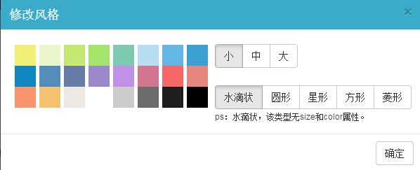

# 海量点图层修改设置：修改样式、查看数据视图

今天小图给给大家介绍一下如何修改海量点图层的**显示样式、查看数据视图**等操作。

如下图所示点击图层名称右边的图层操作按钮，依次可对区域数据进行**「设置样式」、「查看数据视图」、「更多设置」**操作。

    
1、**设置样式：**点击图层名称右边的按钮，对点的显示样式进行修改。可设置点的大小、颜色及形状，如下图所示：

2、查看数据视图：点击图层名称右边的按钮，可查看数据视图表。

注意：由于数据量比较大，这里目前仅能查看数据，而不能进行其他操作。

3、更多设置：点击图层名称右边的   按钮，可对图层进行2种操作：

重命名图层：对图层重命名。

删除图层：删除该图层。
 