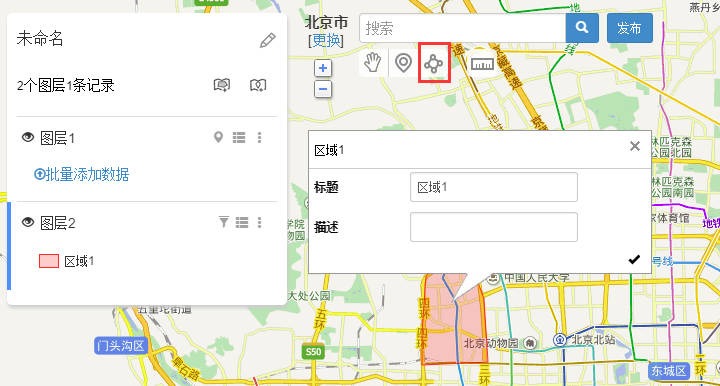

# 如何在地图上划分销售区域、配送范围

经常会遇到需要在地图上绘制销售片区、配送范围、学校招生范围、民警管辖片区、商圈等的情况，利用地图无忧的绘制区域功能，可非常方便的搞定这个问题。

登录后进入工作台，新建地图，在地图编辑界面，点击工具栏中的“**添加区域**”按钮，在地图上**用鼠标点击，绘制你需要的片区范围，双击结束即可**    。重复绘制，便可轻松完成整个地区的片区划分、配送范围划分。

画完片区后，完了吗？你肯定也不想就这样。可以继续完善，比如给不同的区域设置不同的颜色，添加不同的字段信息，比如负责人等。对于左侧列表，其他不需要的图层，可以删除之。

完善之后，**发布地图**！根据不同需求，你还可以：

1、进行订单或地址的定位，判断输入的地址属于哪个片区。

2、把片区地图嵌入到你们的网站。

3、批量添加点标注数据，用于业务数据可视化分析。

此外，不仅支持在电脑上看区域，手机APP也支持哦，随时随地。

在手机网页或微信里访问该地图的链接，也有很好的适配效果哦。

如果绘制完毕后，还有其他需求，也可以联系地图小助手为你实现哦。

此外，如果你在其他平台或软件已经绘制好了区域数据，也可以联系我们帮你导入，无需重复绘制。
