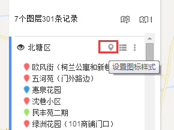

# 批量修改点标注的图标样式

地图无忧中不仅可以对单个点的图标样式进行修改，还支持对某一图层所有点的图标样式进行批量修改。   

1、点击图层名称右边的 20 第1张按钮，对点的图标样式进行批量修改。
](批量修改点标注的图标样式1.jpg)

2、可按三种模式来批量修改图标样式:

（1）统一模式：所有点的显示样式一样。

（2）按字段分类：依据字段，对点进行分类。同类点显示样式一样；不同类点显示样式不同。

（3）排序样式：对点按照序号进行排序，可修改排序的风格和样式。

如果您对批量修改的样式不满意，您可以对单个点进行逐一修改，见：编辑点标注数据编。