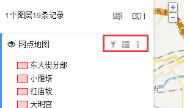
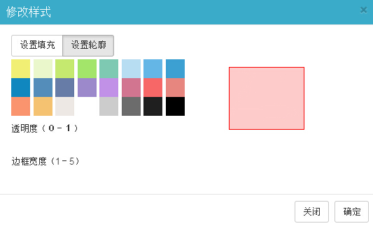

# 区域图层修改设置：样式修改、查看数据视图

地图无忧中不仅可对单个区域数据进行修改，还可通过修改图层来批量修改区域数据。如下图所示点击图层名称右边的按钮，依次可对区域数据进行「**设置样式**」、「**查看数据视图**」、「**更多设置**」操作。

**1、设置样式：**可设置面域显示时的填充颜色、透明度和轮廓宽度，如下图所示：

**2、查看数据视图：**通过该功能可查看数据视图表，用列表的形式来进行数据查看、查找、批量修改、增加列、删除列、下载数据等操作。

**3、更多设置：**可对图层进行如下5种操作， 

标签设置:选择相应的字段，作为点在地图中的显示标签。
标题设置:选择相应的字段，作为点在图层列表和窗体上的显示标题。
图层编号:图层标识，便于在其他地图中重用该图层。
重命名图层：对图层重命名。
删除图层：删除该图层，包括图层下面的所有数据。