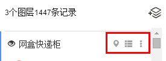

# 热力图图层修改设置：修改显示效果、查看数据视图

今天小图给大家介绍一下如何修改热力图的显示样式、查看数据视图等操作。其操作与海量点图层修改设置方式基本一样，详细如下：

1、如下图所示点击图层名称右边的图层操作按钮，依次可对区域数据进行「**设置样式**」、「**查看数据视图**」、「**更多设置**」操作。

2、**设置样式**：点击图层名称右边的   按钮，对热力图的显示样式进行修改。可设置数据点影响范围半径、显示的颜色，如下图所示：

3、**查看数据视图**：点击图层名称右边的按钮，可查看数据视图表。注意：这里目前仅能查看数据，而不能进行其他操作。

4、**更多设置**：点击图层名称右边的按钮，可对图层进行2种操作：

重命名图层：对图层重命名。

删除图层：删除该图层。
