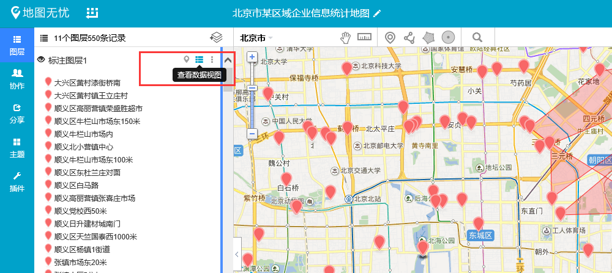
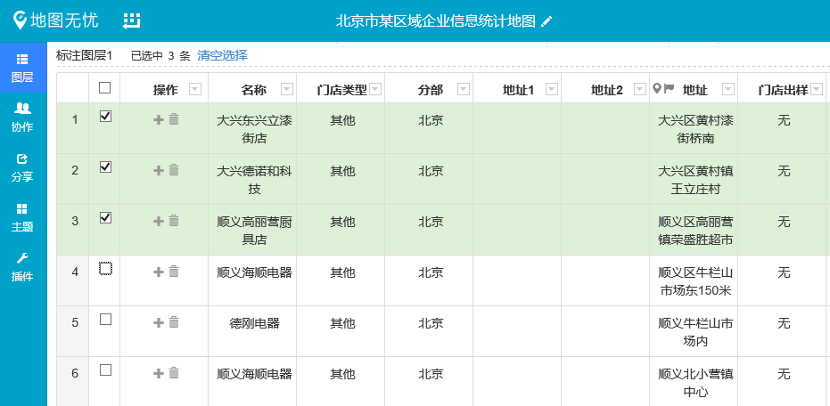
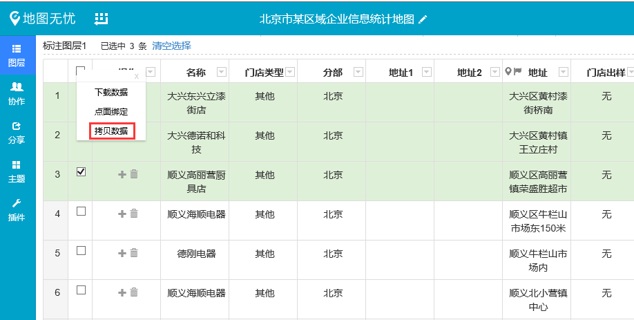

# 如何拷贝数据到新建图层中

很多用户在新建图层的时候想引用另外一个图层中个别的数据信息，或者说想把图层1中的部分数据挪用到图层2中，重新筛选出所需的数据上传会很麻烦，如果能够直接拷贝所需的数据信息到新建图层中就非常简捷省事了，下面是小图为大家介绍的一个小技巧——如何拷贝数据到新建图层中

1、点击拷贝数据所在图层中的“**查看数据视图**”按钮

2、选中需要拷贝的数据信息

3、点击“操作”按钮，选择“拷贝数据”

4、选择需要拷贝数据的图层。

**注:**“拷贝数据”的功能可以拷贝各种图层类型内的数据，但是需要拷贝数据的图层要和数据原来所在图层的类型一致。
