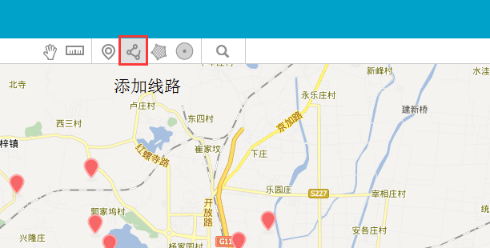
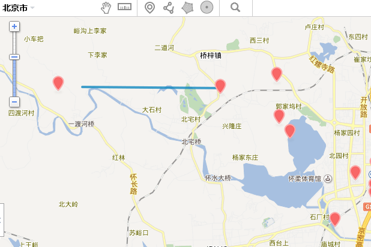
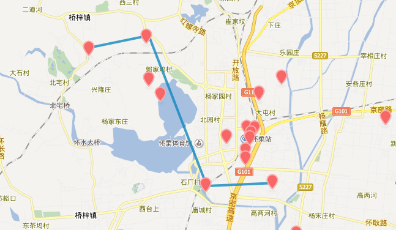

# 如何在图层上添加线路

很多用户在制作专属业务地图时，需要按照自己的意愿在地图上规划一下线路，这需要用到添加线路功能。

**下面小图给大家讲一下如何在图层上添加线路**

1、如下图所示点击图层上方的“**添加线路**”按钮

2、鼠标指针会变成“**+**”的样式，点击线路的开始处按照自己的需求向另一个目的地移动鼠标

3、点击线路，会出现编辑线路的条框，如何在图层上添加线路 第6张可依次对线路进行「编辑样式」、「开始/结束编辑节点」、「编辑属性」、「删除」操作。

**编辑样式：**编辑线的透明度、宽度、颜色

**开始/结束编辑节点：**编辑线路的节点(转折点)

**编辑属性：**编辑线路的描述