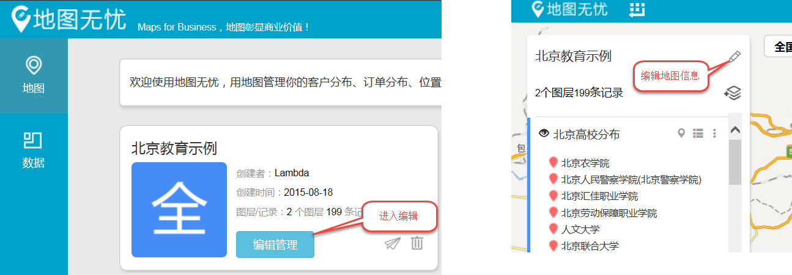
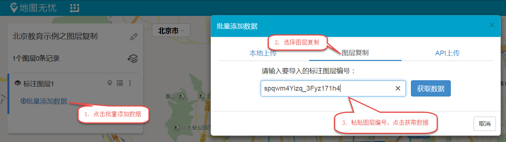
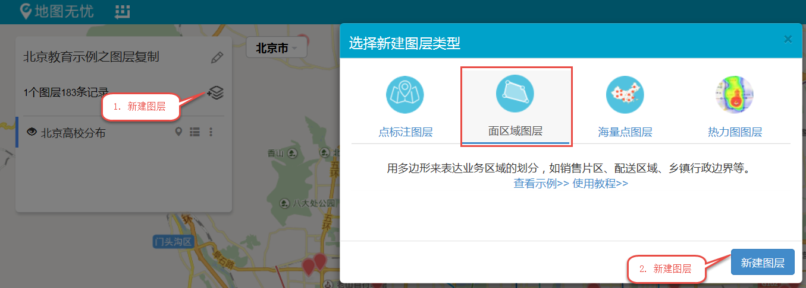
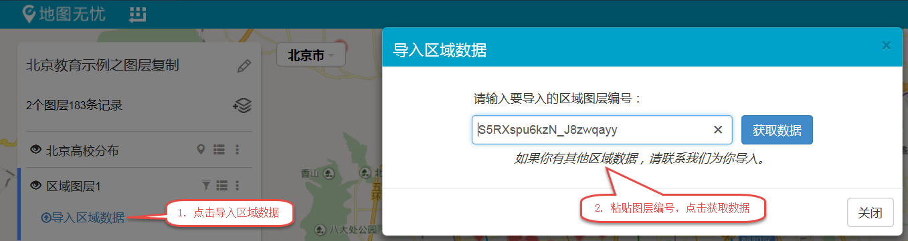

# 如何重复使用已有图层

已经绘制好的标注和区域数据图层（包括数据和样式），可以在**多幅地图中重复使用**，无需重新绘制。如何操作呢？只需两步，跟小图来体验一下神奇的乾坤大挪移吧。

**1**.  在原地图中，复制已有图层的编号。

点击地图列表中的“编辑管理”进入编辑；打开地图后点击“编辑”按键，开始编辑地图信息；

在图层列表中选择想要使用的图层，如北京高校分布图层，点击该图层的「更多设置」按钮，选择“图层编号”，弹出“区域图层编号”窗口，复制图层编号，点击关闭。
    

**2**. 通过图层编号将原图层加入新地图。

如果需要重用的图层是标注图层：

点击“新建图层”按钮，弹出“选择新建图层类型”对话框，选择“点标注图层”，点击“新建图层”；

点击“批量添加数据”按钮，弹出“批量添加数据”对话框，选择“图层复制”，粘贴图层编号，点击“获取数据”按钮即可大功告成。

如果需要重用的图层是区域图层：

点击“新建图层”按钮，弹出“选择新建图层类型”对话框，选择“在区域图层”，点击“新建图层”；

点击“导入区域数据”按钮，弹出“导入区域数据”对话框，粘贴图层编号，点击“获取数据”按钮即可大功告成。

