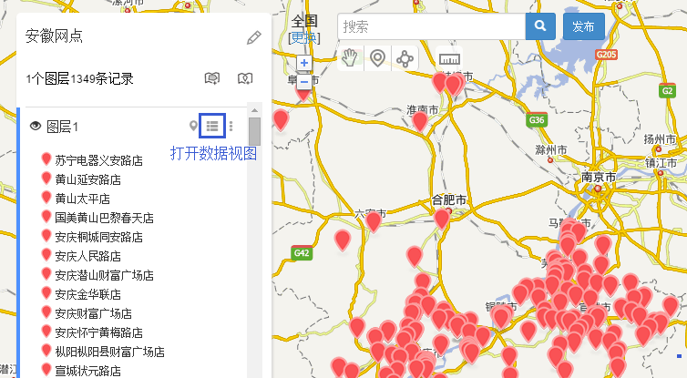
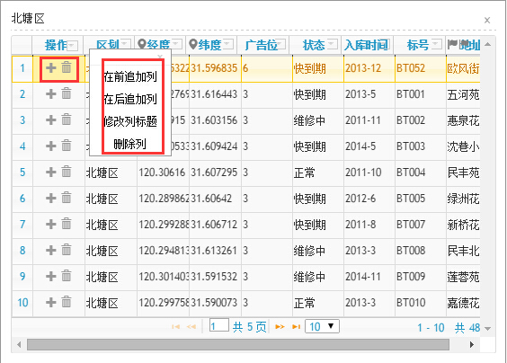
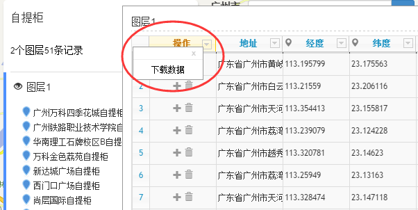

# 数据表格视图：添加行列、下载数据

每个图层除了可以在地图上查看外，还可以查看数据视图，用列表的形式来进行数据查看、查找、批量修改、增加列、删除列、下载数据等。

如果所示，点击图层标题右侧的**查看数据**列表按钮，即可打开数据表格视图。

打开数据视图后，点击某列字段的**小箭头**，可对行进行操作；点击“**操作**”下面的「**添加 删除**」按钮，可对行进列操作。

**（1）针对行：**添加、删除某一行数据；点击数据视图里面的表格，可以修改其的属性值。

**（2）针对列：**添加、删除某一列数据，可以修改列的标题。

点击“**操作**”旁边的**小箭头**，则可以**下载表格数据**，下载的数据包括经纬度、添加时间、修改时间等信息。

