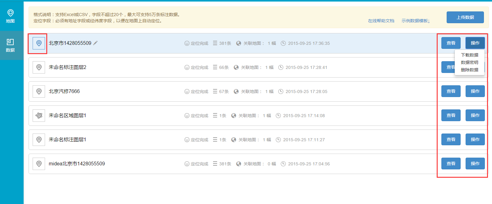
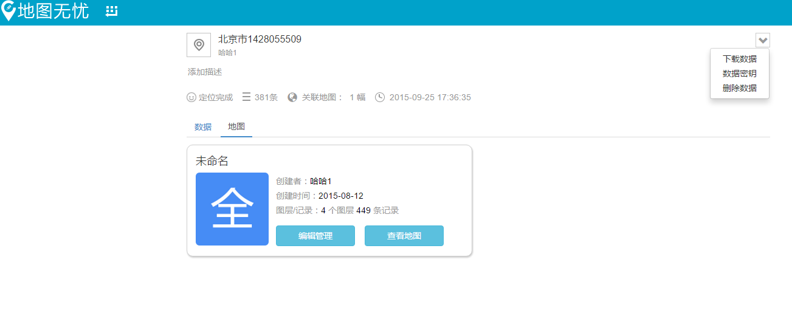
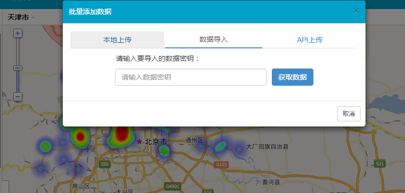
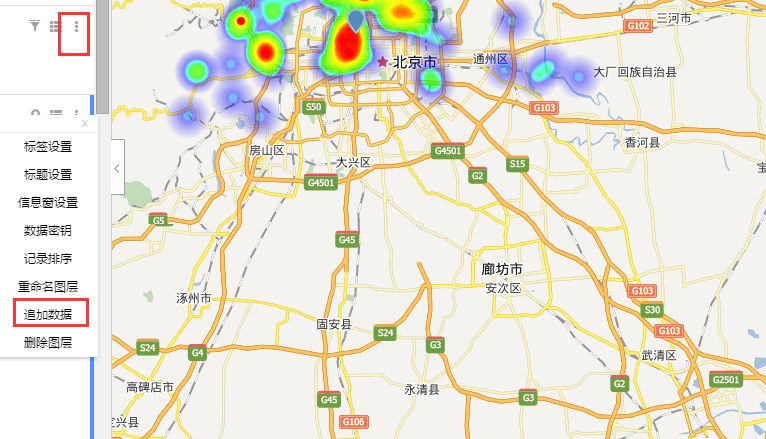

# 数据模块改版，更便捷，更智能

数据地图，顾名思义，是以地图的形式来展现数据的；也就是说数据是根本，地图是一种展现形式。那么，数据的重要性也由此体现出来了。

为了让用户更高的体验数据地图的优势，地图无忧的数据模块改版了,从真正意义上让用户通过数据来掌握所需的地图形式，更方便于用户对于数据地图制作的操作，下面我们来一起看看有哪些改动吧。

1、由原来只有单调的”**关联地图**”和”**删除**”功能，改成了现在的“**查看**”和“**操作**”。机智的您肯定看出来了，改版后的奥妙就蕴藏在“**查看**”和“**操作**”这两个按钮中……  

2、相信您肯定看到了数据名称前的图标了，这个图标代表着此数据所呈现出来的图层形式。

3、 接下来就是重要的部分了，查看按钮中的内容，点击进去是下图所示的样子，用户可以在数据模块查看和编辑管理图层，还可以通过右上角的三个功能来实现自己的需求，是不是更方便了？

4、操作按钮内的功能内容其实是和上图所示右上角的内容是一样的，但不一样的是用户可以直接在数据模块界面直接操作。

5、相信您对于“**数据秘钥**”的功能还不很清楚，其实”**数据秘钥**”和之前的”**数据编号**”在图层中的意义是一样的；只是从技术角度来说，“**数据编号**”是一个图层的标示，而”**数据秘钥**”是数据的唯一标示，”**数据秘钥**”更能体现出数据地图的以数据为根本的奥义。

**仅仅是这些功能改了吗？并不是，真正的重点在这里呢**

6、在图层的”**更多设置**”内，增加了一个“**追加数据**”的功能，“**追加数据**”的运用真正的实现了数据合并的功能。也就是说，用户在同一地图中可以运用多条数据来展现更加全面的数据信息，是不是很智能呢？

对于地图无忧的整个宏图而言，以上功能的实现只是冰山一角，相信通过地图无忧程序猿们的不懈努力，更多、更惊艳的功能会一步步上线，为广大用户提供更全面更细致的地图服务。