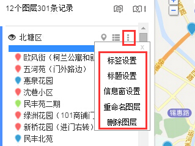
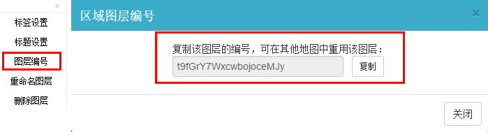

# 图层设置功能

今天小图给大家介绍一下如何对图层的属性进行设置操作。点击图层名称右边的按钮，打开图层名称右边的「**更多设置**」功能，可以对图层进行5种操作，如下图。

1、**标签设置:**选择相应的字段，作为点在地图中的显示标签。

2、**标题设置:**选择相应的字段，作为点在图层列表和窗体上的显示标题。

3、**信息窗设置:**设置在信息窗体中显示或隐藏的字段。

4、**重命名图层：**对图层重命名。

5、**删除图层：**删除该图层，包括图层下面的所有数据。

以上说的是标注图层的设置，区域图层的设置一样，只有第3点不同，区域图层里面是获取**图层编号，便于在其他地图中重用该图层。**

