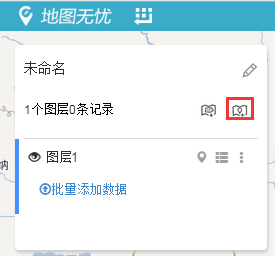
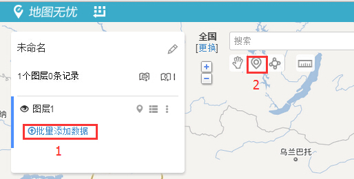
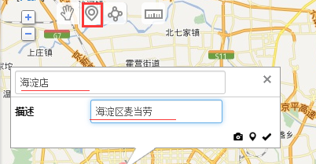
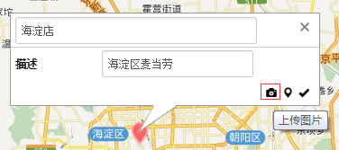
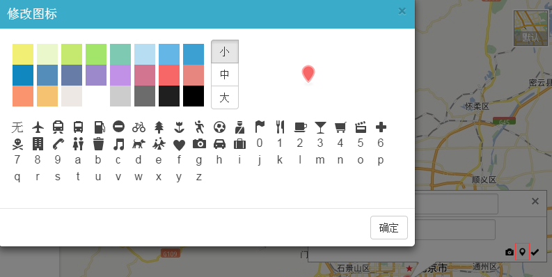

# 网点标注地图入门

在制作专属业务地图时，需要把店铺、网点等信息标注到地图上，这需要用到添加点数据功能。如何添加点数据呢？让地图小助手给您慢慢道来。

1、点击按钮，新建标注图层（在新建地图时，系统已经自动添加了一个标注图层，此步可省略）。

2、在新建的图层下面，添加你的网点标注。有2种方式：

(1)使用“批量添加数据”工具进行批量标注，适用于批量标注较多的数据。

(2)使用点标注工具，在地图上逐个标点，适用于标注较少的数据，如下图所示：

3、点击工具，在地图上标点，并填写点的名称和描述信息，如下图所示：
](网点标注地图入门3.png)

4、点击按钮，给点添加图片。

有三种添加图片来源的方法：网络图片、本地图片及我的图片，也可以在手机APP上拍照上传图片。

5、点击按钮，更换图标的显示方式，可以选择大小、颜色及标识等，如下图所示：

通过这几步，您就在地图上成功地标注了一个点，您可以依照此方法继续标注其它点。此外，您还可以用手机移动端进行网点标注的添加、修改和管理。如有遇到困难，请随时联系地图小助手。