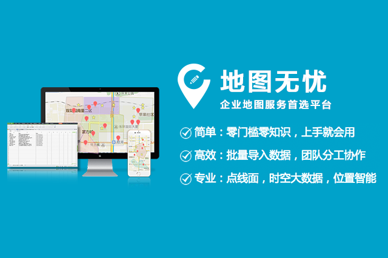

# 这些特性,您都造吗

在我们程序猿的努力下，地图无忧又更新了一些新的特性，这些特性您都造吗？ 

**1、按区域统计分析：**

可以设置统计图层、统计字段和统计分类

统计字段会按照用户上传数据的字段自动生成

统计类型：求和、分类求和

**2、“添加线路”功能：**

方便用户在地图上进行线路规划，详细操作方式参照帮助教程

**3、“网点描述”内的“上传图片”功能：**

由原来的最多可上传10张图片增加到20张，更方便用户对于网点信息的描述

**4、自定义图标：**

用户可以根据自己的喜好,自定义设置图标，以达到更好的展示效果

**5、移动端：**

Android版本可以通过Web端进行访客、成员、管理员权限的设置。

